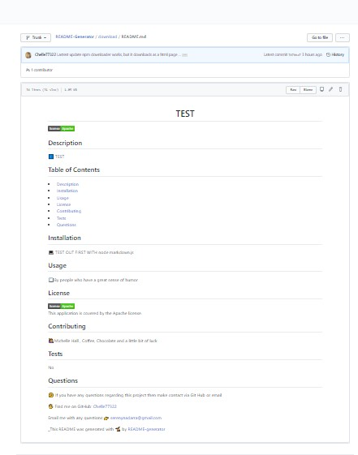

# README-Generator
A command line application that accepts user input to generate a professional looking README for use in future projects.

<h1 align="center">Node.js application: README-Generator</h1>
   
  

    

    

  

    
    
    
    
     
      
    
    

# Description:
Using Node.js and npm packages: inquirer, file system, utils, downloader to create a command line application that processes user input into a markdown file with the file name of README.md.
Additional code allows the fully generated README.md file to be currently downloaded as an unformatted html page. This needs work on custom file names in future developments

# Installation:
npm init
npm install -inquirer
npm install -fs
npm install -utils
npm install -downloader

# Usage:
run node markdown.js

# Video

Full Video can be downloaded here <a href = "https://github.com/Chelle77322/README-Generator/blob/Trunk/assets/files/README-Generator.mp4">README Video</a>

# Screenshots

# Credits
"http://creativecommons.org/licenses/by-sa/4.0/legalcode"

"https://www.nodebeginner.org/"

"https://www.npmjs.com/package/nodejs-file-downloader"

# Future Developments
Current future developments include: Getting the file download to work as a *md (markdown file) not a html page

# Git Hub Repository
https://github.com/Chelle77322/README-Generator/

