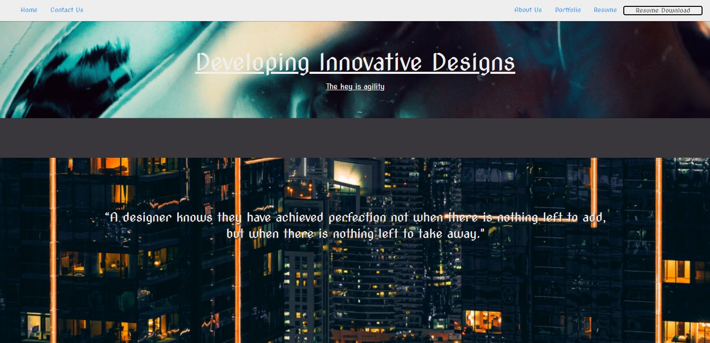
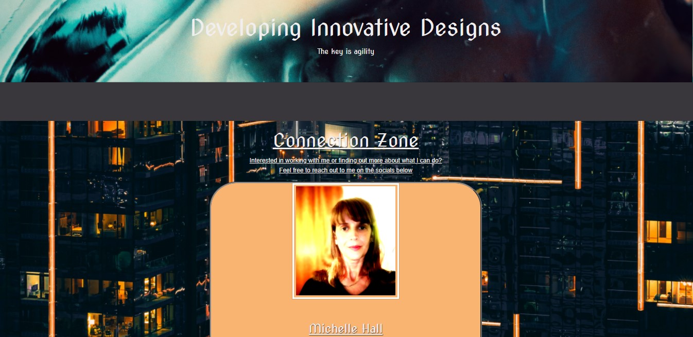
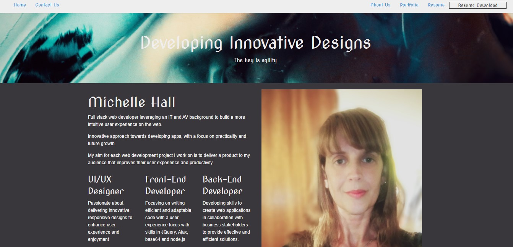
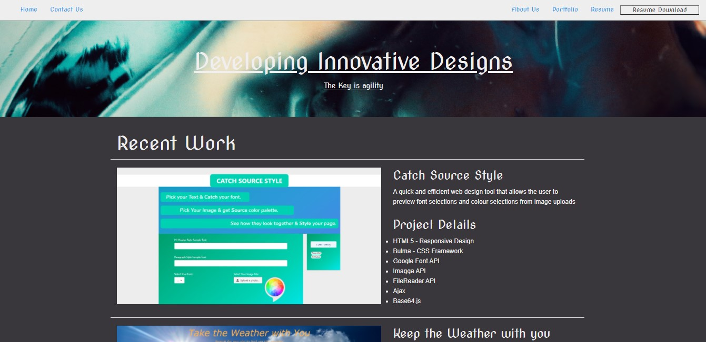

# Chelle77322.github.io
Michelle Hall Full Stack Web Developer Portfolio: Welcome to my personal github portfolio page as I study at the University of Adelaide: Full-Stack Developer Bootcamp.
Join me on my journey to become a full-stack web developer

# Description:
A showcase of my skills in both front-end and back-end coding to potential clients and employers

# Screenshots

# Credits
"https://use.fontawesome.com/releases/v5.14.0/js/all.js"
"https://ajax.googleapis.com/ajax/libs/jquery/3.5.1/jquery.min.js"
"https://cdnjs.cloudflare.com/ajax/libs/foundation/6.6.3/js/foundation.min.js
"https://code.jquery.com/jquery-2.1.4.min.js"
"https://dhbhdrzi4tiry.cloudfront.net/cdn/sites/foundation.js
"https://ajax.googleapis.com/ajax/libs/jquery/3.0.0/jquery.min.js

"https://dhbhdrzi4tiry.cloudfront.net/cdn/sites/foundation.min.css
"https://fonts.googleapis.com/"
"https://fonts.googleapis.com/css2?family=Bebas+Neue&family=Nunito:ital,wght@0,200;0,300;0,400;0,600;0,700;0,800;0,900;1,200;1,300;1,400;1,600;1,700;1,800;1,900&display=swap"

# Future Developments
Current future developments include  professional skill developments to include React.js, mySQL and MongoDB interactivity

Authors
Back-end coding and development: Michelle Hall
Front-end design and development: Michelle Hall

# Working Product
https://chelle77322.github.io/index.html

